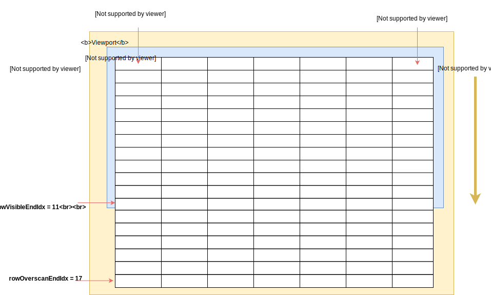
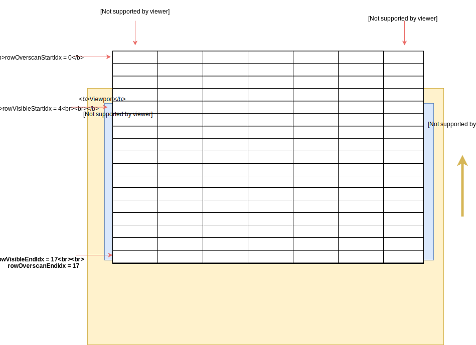
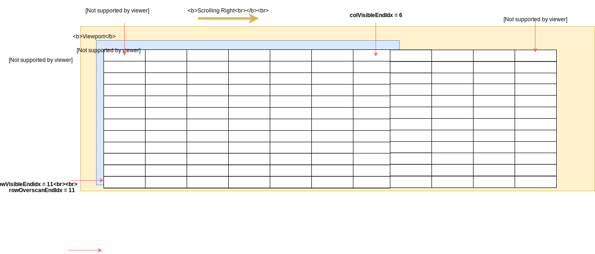

## Data Virtualization
ReactDataGrid has been optimized to render data in a highly efficient manner. The grid data is virtualized both for rows as well as columns, only rendering exactly what is necessary to the viewport to allow for performant grid interaction, like for actions such as scrolling and cell navigation. The calulation for which rows and columms to render to the Canvas happens in the [Viewport](https://github.com/adazzle/react-data-grid/blob/master/packages/react-data-grid/src/Viewport.js). 

It uses input parameters such as gridHeight, rowHeight, scroll length and direction to determine the visible and overscan indexes of the rows and columns. Rows and columns which fall between the visible indexes are rendered to the Canvas and are visble. Rows and columns which fall outside the visible indexes but inside the overscan indexes are also rendered to the Canvas but are not visible. This buffer of rows and columns allows for smooth scrolling with minimal lag even for data sets that contain thousands of rows and columns. 

### Virtualization props
The most important props that the Viewport passes to the Canvas are the following:

- rowOverscanStartIdx - The index of the first invisible row to be rendered to the canvas.
- rowOverscanEndIdx - The index of the last invisible row to be rendered to the canvas.
- rowVisibleStartIdx - The index of the first visible row to be rendered to the canvas.
- rowVisibleEndIdx - The index of the last visible row to be rendered to the canvas.
- colVisibleStartIdx - The index of the first visible column to be rendered to the canvas.
- colVisibleEndIdx - The index of the last visible column to be rendered to the canvas.
- colOverscanStartIdx - The index of the first visible column to be rendered to the canvas.
- colOverscanEndIdx - The index of the last visible column to be rendered to the canvas.

### Virtualization when scrolliing
When the grid is being scrolled, it is important that only the minimal necessary amount of rows and columns are rendered to the canvas. One way that ReactDataGrid optimises this range, is using the scroll direction. See the diagrams below for an example of how the rendered rows are calculated on scrolling

### Scrolling downwards
When scrolling downwards, it is unnecessary to render any columns outside of the visible window. Rendering a buffer of extra columns will only slow down scrolling and create lag. The only buffer that should be rendered is the rows at the bottom of the canvas. These overscan rows will make scrolling appear smoother as the rows already exist in the dom at the time the viewport scrolls to their position. 

### Scrolling upwards
When scrolling upwards, the only buffer that should be rendered is the rows at the top of the canvas.

### Scrolling right
When scrolling right, it is unnecessary to render any rows outside of the visible window. Rendering a buffer of extra rows will only slow down scrolling and create lag. The only buffer that should be rendered are some overflow columns to the right of the canvas. These overscan columns will make horizontal scrolling appear smoother as the columns  already exist in the dom at the time the viewport scrolls to their position. 

### Scrolling Left
When scrolling upwards, the only buffer that should be rendered is some columns to the left of the canvas. This is reverse of the previous image.